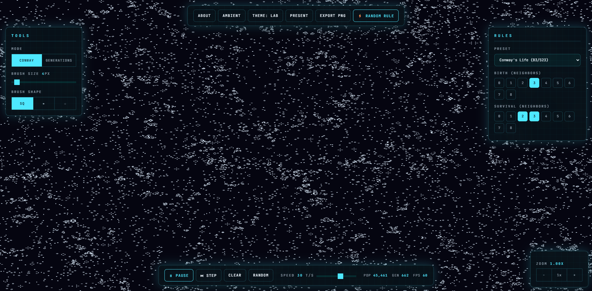

# Forma — Cellular Automata Sandbox

An interactive cellular automata sandbox running in the browser. The simulation core is written in **Rust compiled to WebAssembly**, giving it raw performance to simulate a 1024×1024 grid at 60fps. The frontend is plain **HTML + CSS + Canvas/WebGL2** - no frameworks.

## Live Demo

https://fatin-ishraq.github.io/Forma/

## Screenshot



## Features

- **2 simulation modes**: Conway-style life rules and multi-state Generations rules
- **Live rule editing**: tweak birth and survival masks, generations count, and presets in real time
- **Paint & erase**: draw directly on the grid with square, circle, or spray brushes
- **Pan & zoom**: pan the view and zoom up to 32x
- **Themes**: switch the visual palette and rendering mood instantly
- **Ambient mode**: enter a calmer hands-off viewing mode with curated scenes and camera drift
- **Export**: capture the current view as a PNG

## Build & Run

### Prerequisites
- [Rust](https://rustup.rs/) (1.70+)
- [wasm-pack](https://rustwasm.github.io/wasm-pack/installer/) (0.10+)

### Build
```bash
# Install wasm-pack if needed
cargo install wasm-pack

# Build the WASM module
wasm-pack build --target web --out-dir www/pkg
```

### SIMD (optional, for extra performance)
```bash
RUSTFLAGS="-C target-feature=+simd128" wasm-pack build --target web --out-dir www/pkg
```

### Serve
```bash
cd www
python3 -m http.server 8080
# or any static file server
```

Then open `http://localhost:8080` in a modern browser (Chrome/Edge recommended).

## Deploy (GitHub Pages)

This repo uses GitHub Actions to build wasm and deploy Pages automatically from `main`.

1. Push to `main`.
2. In GitHub, set Pages source to `GitHub Actions`.
3. Workflow `.github/workflows/deploy-pages.yml` builds `www/pkg` and deploys `www/` as the site artifact.

## Project Structure
```
forma/
├── Cargo.toml          # Rust crate config
├── src/
│   └── lib.rs          # Rust/WASM simulation core
├── www/
│   ├── index.html      # UI structure
│   ├── style.css       # Glassmorphism design
│   ├── main.js         # WebGL rendering + UI logic
│   └── pkg/            # wasm-pack output (generated)
└── README.md
```

## Presets

### Conway Mode
Life, HighLife, Day & Night, Seeds, Maze, Replicator, 34 Life

### Generations Mode
Brian's Brain, Star Wars, Fireworld

## Controls
| Input | Action |
|-------|--------|
| Left click + drag | Paint cells |
| Right click + drag | Erase cells |
| Middle click / Space + drag | Pan view |
| Scroll wheel | Zoom in/out |
| A | Toggle ambient mode |
| D | Cycle theme |
| F | Toggle presentation mode |
| ⚡ RANDOM RULE | Randomize rules + grid |

## Tech Stack
- **Rust + wasm-bindgen** → WebAssembly simulation core
- **WebGL2** → GPU-accelerated rendering with bloom
- **Vanilla HTML/CSS/JS** → no frameworks, no bundlers
